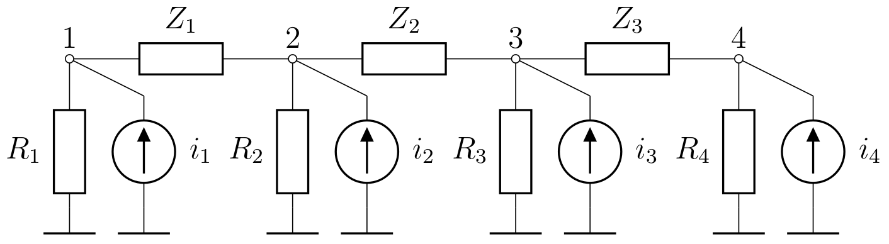
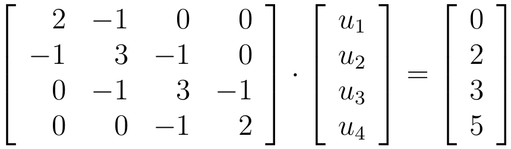
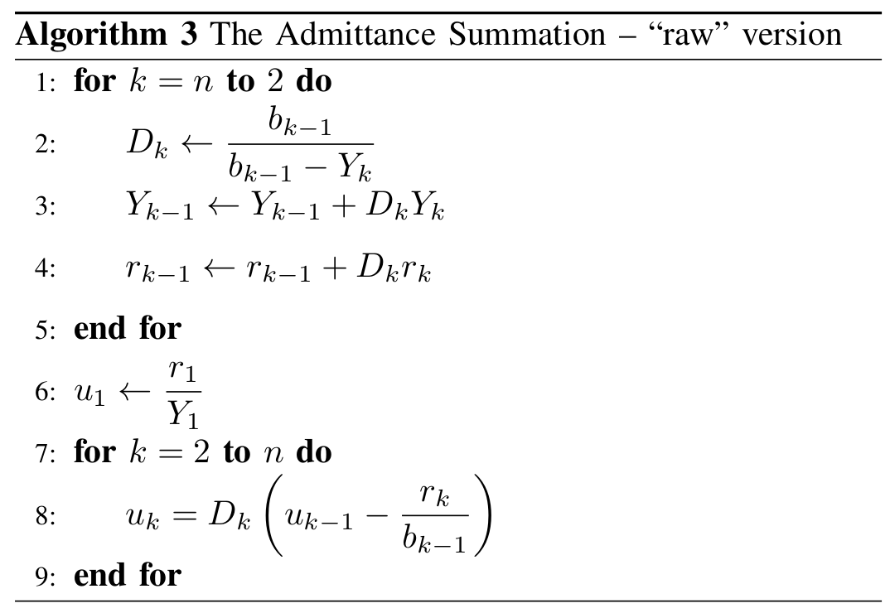
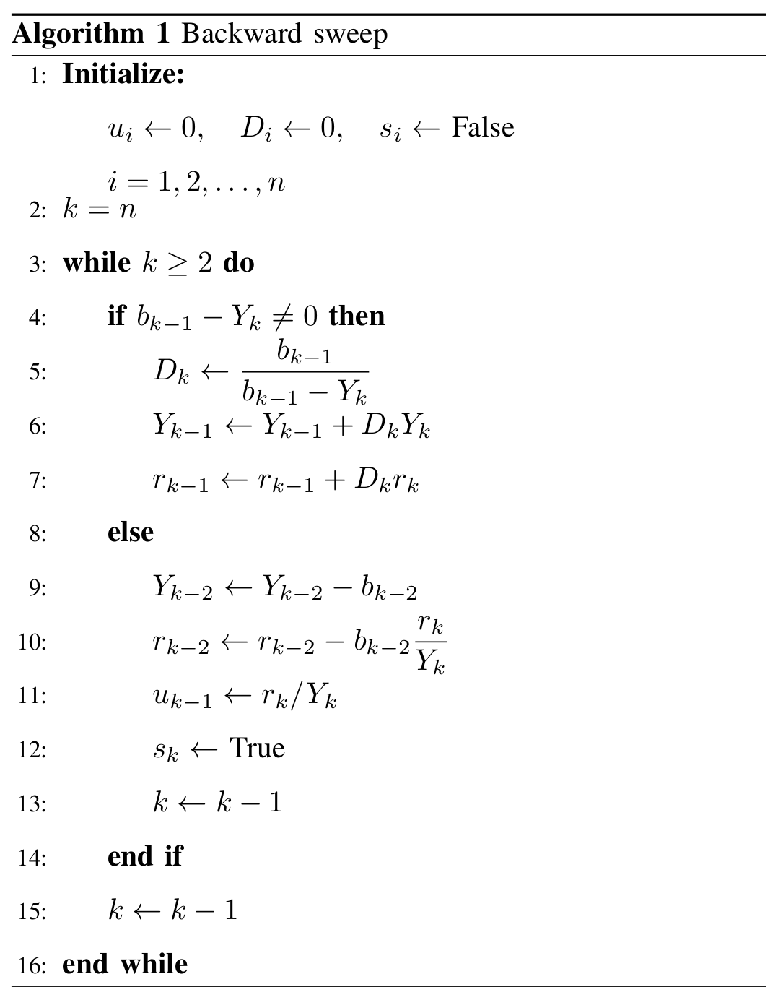
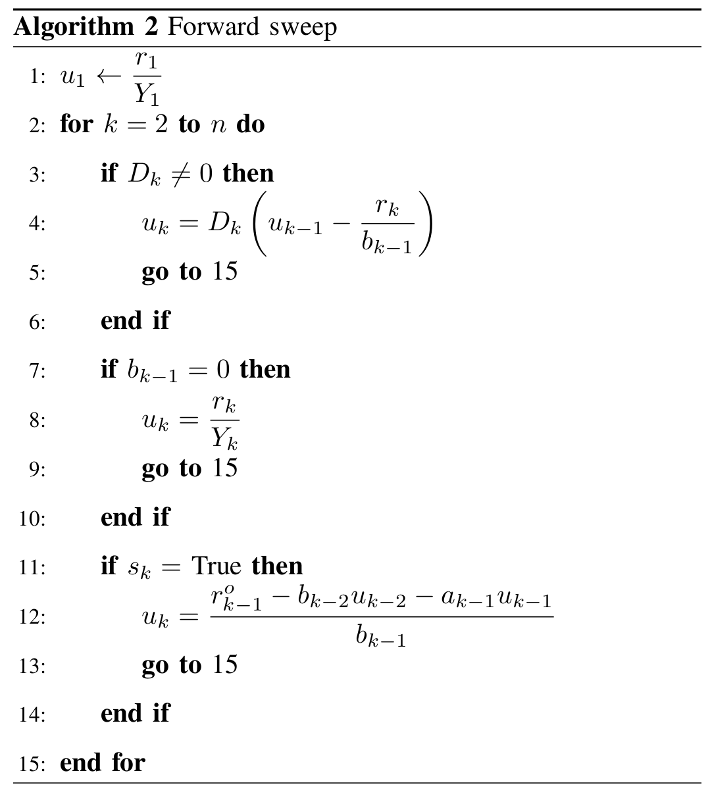

# Solving Tridiagonal Symmetric Systems of Equations Using Circuit Theory Approach

We propose a novel solution method for symmetric tridiagonal systems. The main idea is to construct a specific electric circuit with the same node-voltage equations as the original system. This circuit has a specific “ladder” structure and it is efficiently solved using a methodology know as the admittance summation method [[1]](#1). The method avoids possible zero divisions exploiting the specific structure of the circuit. This specific property is an equivalent to a pivoting strategies used in other methods.

The test have shown that the performance of the proposed method is comparable to the Thomas algorithm [[2]](#2) and Gaussian elimination adapted for tridiagonal systems [[3]](#3), as well as the Matlab backslash operator.

|  |
| :--------------------------------------------------------: |
|             Fig. 1. A Simple Electric Circuit              |

For the circuit from Fig. 1 we assume that all resistors are with resistance of 1 Ω and the independent current sources are *i*<sub>1</sub> = 0 A, *i*<sub>2</sub> = 2 A, *i*<sub>3</sub> = 3 A and *i*<sub>4</sub> = 5 A. In this case the following system of equations solves for circuit voltages.

|  |
| :-------------------------------: |
| Fig. 2. Tridiagonal System of Equations |

Of course, we do not store the full *n* × *n* matrix, but only its nonzero elements stored as two row vectors **a** and **b** for the main diagonal and diagonals below and above the main diagonal. They are **a** = [2 3 3 2] and
**b** = [-1 -1 -1]. Right-hand side vector is **r** = [0 2 3 5].

The input data is given in ex_1.m as a function returning **a**, **b** and **r**.

```matlab
function [a, b, r] = ex_1()
a = [2 3 3 2];
b = [-1 -1 -1];
r = [0 2 3 5];
```

The solution is obtained with

`u = tridiag_ysum(a, b, r)`

The method consist of the following steps

## Initialization

Calculate vector **Y**

**Y** = **a** + [0 **b**] + [**b** 0],
where [0 **b**] is a concatenation of 0 and row vector **b**, while [**b** 0] is another concatenation where 0 is added after **b**.

## Simple Algorithm

May fail for systems that are ill-conditioned or have zero diagonal/off-diagonal elements.



## Complete Algorithm

Detects possible divisions by zero and handles them without the need for pivoting.

#### Backward sweep



#### Forward sweep



## References
<a id="1">[1]</a> D. Rajičić, R. Taleski, Two novel methods for radial and weakly meshed network analysis, Electric Power Systems Research 48 (2) (1998) 79 – 87

<a id="2">[2]</a> W. H. Press, S. A. Teukolsky, W. T. Vetterling, B. P. Flannery, Numerical Recipes – The Art of Scientific Computing, 3rd Edition, Cambridge University Press, 2007, Ch. 2.4, pp. 56–57.

<a id="3">[3]</a> D. Kincaid, W. Cheney, Numerical Analysis – Mathematics of Scientific Computing, American Mathematical Society, 2002, Ch. 4.3, pp. 179–180.

